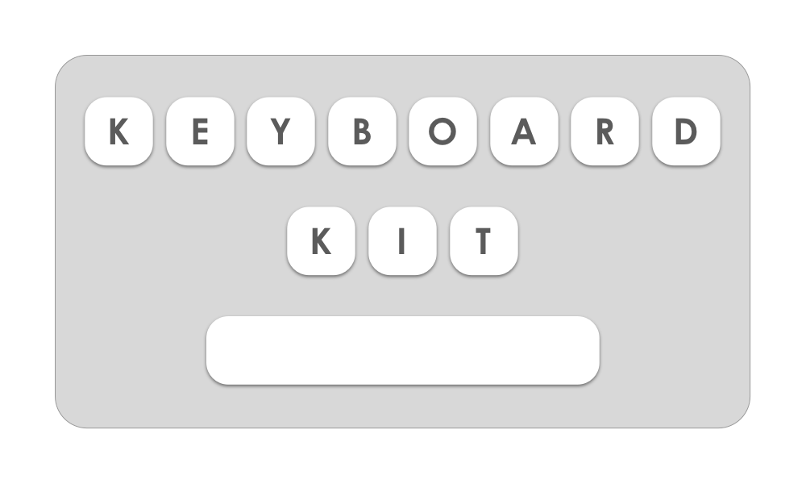

<p align="center">
    
</p>

<p align="center">
    <a href="https://github.com/danielsaidi/KeyboardKit">
        
    </a>
    <a href="https://cocoapods.org/pods/KeyboardKit">
        
    </a>
    <a href="https://github.com/Carthage/Carthage">
        
    </a>
    
    
    
    <a href="https://twitter.com/danielsaidi">
        
    </a>
</p>


## About KeyboardKit

`KeyboardKit` is a Swift library that simplifies creating keyboard extensions for iOS. It supports many keyboard actions and keyboard types and lets you create keyboards with text inputs, emojis, actions, images etc.

<p align="center">
    
</p>

With `KeyboardKit`, you inherit `KeyboardInputViewController` instead of `UIInputViewController`. This provides you with a `keyboardActionHandler` that can handle taps, long presses etc. and a `keyboardStackView` to which you can add components like toolbars, button rows and collection views. `KeyboardKit` also provides you with tools for haptic feedback, displaying alerts on top of the keyboard etc.


## Installation

### CocoaPods

Add this to your `Podfile` and run `pod install`:
```
pod 'KeyboardKit'
```
Then follow [these instructions](#add) on how to add it to your project.

### Carthage

Add this to your `Cartfile` and run `carthage update`:
```
github "danielsaidi/KeyboardKit"
```
Then follow [these instructions](#add) on how to add it to your project.

### Manual installation

To manually add `KeyboardKit` to your app, clone this repository and add `KeyboardKit.xcodeproj` to your project. Then, select the app target, add the `KeyboardKit` framework as an embedded binary (in `General`) and as a target dependency (in `Build Phases`) then follow [these instructions](#add) on how to add it to your project.

<a name="add"></a>
### Important - How to add KeyboardKit to your extension

When you create your own keyboard extension and want to use `KeyboardKit` in it, you must do the following:

* Create a new `Custom Keyboard Extension` target
* In the host app, add `KeyboardKit.framework` to `Embedded Binaries`
* In the extension, add `KeyboardKit.framework` to `Linked Frameworks And Binaries`
* Enable full access in your extension's `Info.plist`, if your keyboard needs it.


## Features


### Keyboard Actions

`KeyboardKit` comes with a set of actions that can be applied to your keyboard buttons:

* `backspace` - sends a backspace to the text proxy when `tapped`
* `capsLock` - can be used to lock the keyboard in upper case
* `character` - sends a text character to the text proxy when `tapped`
* `command` - represents the macOS command key
* `custom(name:)` - a custom fallback if no other actions fits your needs
* `dismissKeyboard` - dismisses the keyboard when `tapped`
* `escape` - represents the macOS esc key
* `function` - represents the macOS fn key
* `image` - has a description, keyboard image name and image name
* `moveCursorBackward` - moves the cursor back one position when `tapped`
* `moveCursorForward` - moves the cursor forward one position when `tapped`
* `newLine` - sends a new line character to the text proxy when `tapped`
* `option` - represents the macOS option key
* `shift` - can be used to toggle between upper and lower case
* `shiftDown` - can be used to toggle between upper and lower case
* `space` - sends an empty space to the text proxy when `tapped`
* `switchKeyboard` - triggers the system switcher when `tapped` and `long pressed`
* `switchToKeyboard(type)` - can be used to switch to a specific keyboard type
* `tab` - sends a tab character to the text proxy when `tapped`
* `none`- use this for empty "placeholder" keys that do nothing

`KeyboardInputViewController` has a `keyboardActionHandler` to which you should delegate all actions. It uses a `StandardKeyboardActionHandler` by default, but you can replace with any implementation.

The `tap` and `long press` behavior described for some actions above is the default behavior that will be automatically applied to a keyboard's buttons if you use the default handler. If you do not, actions only define the standard effect (if any) they should have on input view controllers and text proxies, but you'll have to handle these behaviors in some way.

Most action types have no standard behavior at all, since their behavior depend on your application. For instance, `image` only represents an image button, but there is no universal truth when it comes to how a tapped or long pressed image should be handled.

Some actions in the list represents actions from other platforms. For instance `command`, `function` and `option` doesn't exist in iOS, but may still serve a functional or semantical purpose in your keyboard.


### Keyboard Types

`KeyboardKit` comes with the following built-in keyboard types:

* `alphabetic(uppercase/lowercase)`
* `numeric`
* `symbolic`
* `email`
* `emojis`
* `custom(name)`

These types are just representations, without any built-in logic. You can bind them to keyboard actions to let you add buttons that switches between various keyboard types, but you have to implement the keyboards yourself.

If your app uses a keyboard type that isn't represented in the list above, you can use `.custom` with a custom name.


### Input View Controller

With KeyboardKit, your input view controller should inherit from `KeyboardInputViewController` instead of from `UIInputViewController`. This class has a `keyboardStackView`, to which you can add components like toolbars, button rows and even collection views. It's a regular `UIStackView` that can be customized in any way you like. The extension will be resized to fit the content of this stack view.


## Components

In KeyboardKit, components are protocols that describe various types of components that can be composed into a complete keyboard.

`VerticalKeyboardComponent` describe components that can be added to a vertical flow, e.g. a vertical stack view. It has a height constraint that resizes the component correctly within the flow.

`HorizontalKeyboardComponent` describe components that can be added to a horizontal flow, e.g. a horizontal stack view. It has a width constraint that resizes the component correctly within the flow.

`KeyboardStackViewComponent` specializes `VerticalKeyboardComponent` and describe components that can be added to the main `keyboardStackView`.

`KeyboardButtonRowComponent` specializes `HorizontalKeyboardComponent` and describe components that can be added to button rows.

`KeyboardButton` specializes `KeyboardButtonRowComponent` and describe a keyboard button that has a primary and secondary action. It also provides standard tap, press and release animations.

`KeyboardToolbarComponent` specializes `HorizontalKeyboardComponent` and describe components that can be added to toolbars.

`PagedKeyboardComponent` can be implemented by any view that display pages of keyboard buttons, e.g. collection views. It has functionality for persisting and restoring the current page index.


## Views

In KeyboardKit, most views implement one of the component protocols above.

`KeyboardButtonView` implements `KeyboardButton`. It's a regular `UIButton` that can be setup with a primary and secondary action. 

`KeyboardSpacerView` implements `KeyboardButtonRowComponent`. It's a regular `UIView` that can be used to add additional spaces between components in a button row.

`KeyboardButtonRow` implements `KeyboardStackViewComponent` and displays buttons horizontally within its `buttonStackView`. The stack view is a regular `UIStackView` that can be customized in any way you like. 

`KeyboardToolbar` implements `KeyboardStackViewComponent` and displays views horizontally within its `stackView`. The stack view is a regular `UIStackView` that can be customized in any way you like. 

`KeyboardCollectionView` implements `KeyboardStackViewComponent`. It's a regular `UICollectionView` that can be customized in any way you like. However, since it contains very little logic, you can use the `KeyboardButtonCollectionView` and `KeyboardButtonRowCollectionView` subclasses to get more features out of the box.

Since these views are regular views, you can use them in your hosting application as well.


## Autocomplete

KeyboardKit supports autocomplete, which means that you can display a toolbar that displays autocomplete suggestions for the currently typed text (e.g. the current word) and replace text in your text document proxy whenever a suggestion is tapped. Have a look at the source code and demo app for examples on how to implement this.

**IMPORTANT** iOS has a bug that causes `textWillChange` and `textDidChange` to not be called when a user types and/or text is sent to the text document proxy. This makes autocomplete impossible to implement, since the text document proxy information is not correctly updated when the user types. To solve this, you can create an `AutocompleteBugFixTimer`, which solves the problem by moving the text cursor, thus forcing these functions to be called. However, this is a nasty hack with side-effects, so use it with caution. Check out the source code for more information.


### Alerts

Since keyboard extensions can't display `UIAlertController`s, you can use `KeyboardAlert` to alert messages on top of the keyboard. You can use the built-in `ToastAlert` or create a custom one.


### Haptic Feedback

`KeyboardKit` has a set of `HapticFeedback` variants, that can be used to give the user haptic feedback as she/he uses the keyboard. The `HapticFeedback` enum defines a set of haptic feedback types that wraps native iOS feedback types like `selection changed`, `error`, `success` etc.


### Extensions

`KeyboardKit` comes with a bunch of extensions that simplifies working with keyboard extensions. Many are internal and only used within the library, but some are public and can be used to handle common logic, like saving and exporting images. Check out the example app for more information.


## Demo Application

`KeyboardKit` contains a demo app that contains different kind of keyboards, like numeric keyboards, system keyboards, row-based keyboards and a grid-based emoji keyboard.


## Contact me

I hope you like this library. Feel free to reach out if you have questions or if
you want to contribute in any way:

* E-mail: [daniel.saidi@gmail.com](mailto:daniel.saidi@gmail.com)
* Twitter: [@danielsaidi](http://www.twitter.com/danielsaidi)
* Web site: [danielsaidi.com](http://www.danielsaidi.com)


## License

KeyboardKit is available under the MIT license. See LICENSE file for more info.


[Carthage]: https://github.com/Carthage/Carthage
[CocoaPods]: https://cocoapods.org/
