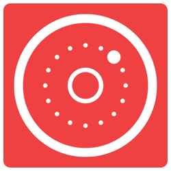

<p align="center">
    
</p>

<p align="center">
    <a href="https://github.com/danielsaidi/KeyboardKit">
        
    </a>
    
    
    
    <a href="https://twitter.com/danielsaidi">
        
    </a>
</p>


## About KeyboardKit

`KeyboardKit` is a Swift library that helps you create keyboard experiences for iOS, e.g. in custom keyboard extensions.

`KeyboardKit` supports a bunch of keyboard actions and keyboard types and lets you create keyboards with text inputs, emojis, actions, images etc.

<p align="center">
    
</p>

If you're new to iOS keyboard extensions, I can recommend reading [this great guide][Guide], which goes through almost everything you need to know about iOS keyboard extensions. 


## Installation

### Swift Package Manager

The easiest way to add KeyboardKit to your project in Xcode 11 is to use Swift Package Manager:
```
https://github.com/danielsaidi/KeyboardKit.git
```

### CocoaPods

```ruby
target 'HostApp' do
  pod 'KeyboardKit'
end

target 'KeyboardExt' do
  pod 'KeyboardKit'
end
```

### Carthage

```
github "danielsaidi/KeyboardKit"
```

### Manual installation

To manually add `KeyboardKit` to your app, clone this repository, add `KeyboardKit.xcodeproj` to your project and `KeyboardKit.framework` as an embedded app binary and target dependency.


## Get Started

With `KeyboardKit`, you should inherit `KeyboardInputViewController` instead of `UIInputViewController`. This provides you with a bunch of stuff, e.g. a  `keyboardActionHandler` that can handle taps, long presses etc. and a `keyboardStackView` to which you can add components like toolbars, button rows and collection views. 

Your custom keyboard extension will automatically be resized to fit the content of this `keyboardStackView`. However, using this stack view is optional. You can setup your custom keyboard extension in any way you like.

`KeyboardKit` also provides you with tools for haptic and audio feedback, displaying alerts on top of the keyboard, views components etc. Have a look at the demo app for more information and examples.


## Keyboard Actions

`KeyboardKit` comes with a set of actions that can be applied to your keyboard buttons, like `character` input, `backspace`, `newline`, `space`, `keyboard switcher`s etc.

Check out [this action guide][Keyboard-Actions] for more information about available actions and how to use them.


## Keyboard Types

`KeyboardKit` comes with the following built-in keyboard types:

* `alphabetic(uppercase/lowercase)`
* `numeric`
* `symbolic`
* `email`
* `emojis`
* `custom(name)`

You can bind these types to keyboard buttons to let the user switch between keyboard types, but since these types have no universal meaning, you have to implement the corresponding keyboards yourself.


## Components and views

`KeyboardKit` comes with a bunch of component and views that can be composed into keyboard, e.g. `vertical and horizontal keyboard components`, `buttons`, `button rows`, `toolbars` etc.

### UIKit

Check out [this component guide][Components] and [this view guide][Views] for more information about available `UIKit` components and how to use them in `UIKit`-based keyboard extensions.

### SwiftUI

Since version `2.7.0`, KeyboardKit has limited support for `SwiftUI`, including new views and tools that helps you build keyboards in SwiftUI. 

I will add readmes and of these later, but until then you can find all about them in the `SwiftUI` folder. The release notes also thoroughly describe the new features.  


## Autocomplete

KeyboardKit supports autocomplete, which means that you can add a toolbar that displays autocomplete suggestions for the currently typed text and replaces the current text in the text document proxy when a user taps a suggestion. 

Check out [this guide][Autocomplete] for more information about how to implement autocomplete.


## Alerts

Since keyboard extensions can't display `UIAlertController`s, you can use `KeyboardAlert` to alert messages on top of the keyboard. You can use the built-in `ToastAlert` or create a custom one.


## Haptic Feedback

`KeyboardKit` has a `HapticFeedback` enum that can be used to give users haptic feedback as they type. It defines native feedback types like `selection changed`, `error`, `success` and makes them easily triggered.

You can enable or disable haptic feedback by providing the `keyboardActionHandler` with a haptic feedback configuration. The default configuration is `none`, which disables haptic feedback.

Note that you have to enable open access for the keyboard for haptic feedback to work.


## Audio Feedback

`KeyboardKit` has an `AudioFeedback` enun can be used to give users audio feedback as they type. It defines native system sounds and makes them easily triggered.

You can enable or disable audio feedback by providing the `keyboardActionHandler` with a audio feedback configuration. The default configuration is `standard`, which means that standard audio feedback will be triggered as users type.

Note that you have to enable open access for the keyboard for audio feedback to work.


## Extensions

`KeyboardKit` comes with a bunch of extensions that simplifies working with keyboard extensions. Many are internal and only used within the library, but some are public and can be used to handle common logic, like saving and exporting images. Check out the example app for more information.


## Demo Application

This repository contains a demo app that demonstrates different kinds of keyboards, including:

 * Alphabetical (lower + upper-case)
 * Numerical
 * Symbols
 * Emojis
 * Images
 
To keep the keyboard layout nice, the image switcher key is only displayed on notch devices, since they don't have to display a next keyboard button.
 
Note that you have to enable open access in keyboard settings for haptic feedback and image actions to work.

To run the demo app, open and run the `KeyboardKit.xcodeproj` project.


## Contact me

Feel free to reach out if you have questions or if you want to contribute in any way:

* E-mail: [daniel.saidi@gmail.com][Email]
* Twitter: [@danielsaidi][Twitter]
* Web site: [danielsaidi.com][Website]


## Clients

KeyboardKit is proudly supported by the following clients:

[](http://anomaly.net.au/)


## License

KeyboardKit is available under the MIT license. See LICENSE file for more info.


[Email]: mailto:daniel.saidi@gmail.com
[Twitter]: http://www.twitter.com/danielsaidi
[Website]: http://www.danielsaidi.com

[Carthage]: https://github.com/Carthage/Carthage
[CocoaPods]: https://cocoapods.org/

[Autocomplete]: https://github.com/danielsaidi/KeyboardKit/blob/master/Readmes/Autocomplete.md
[Components]: https://github.com/danielsaidi/KeyboardKit/blob/master/Readmes/Components.md
[Keyboard-Actions]: https://github.com/danielsaidi/KeyboardKit/blob/master/Readmes/Keyboard-Actions.md
[Views]: https://github.com/danielsaidi/KeyboardKit/blob/master/Readmes/Views.md

[Guide]: https://shyngys.com/ios-custom-keyboard-guide
