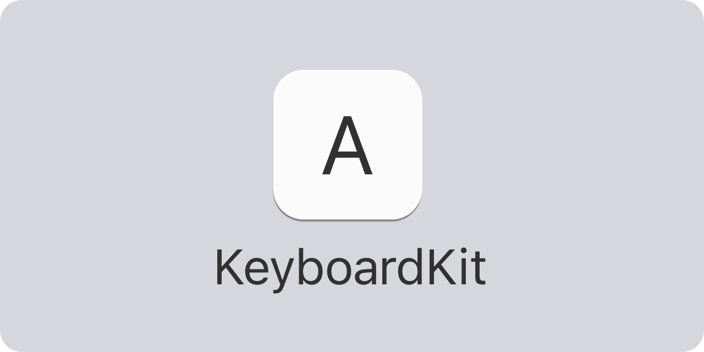
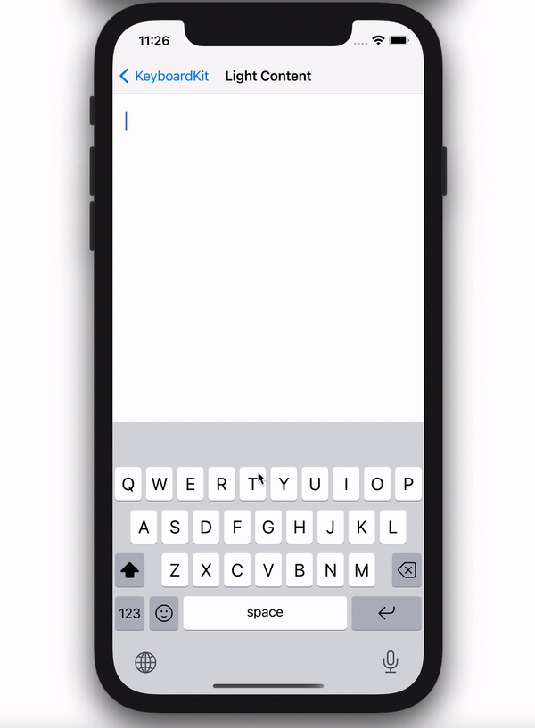
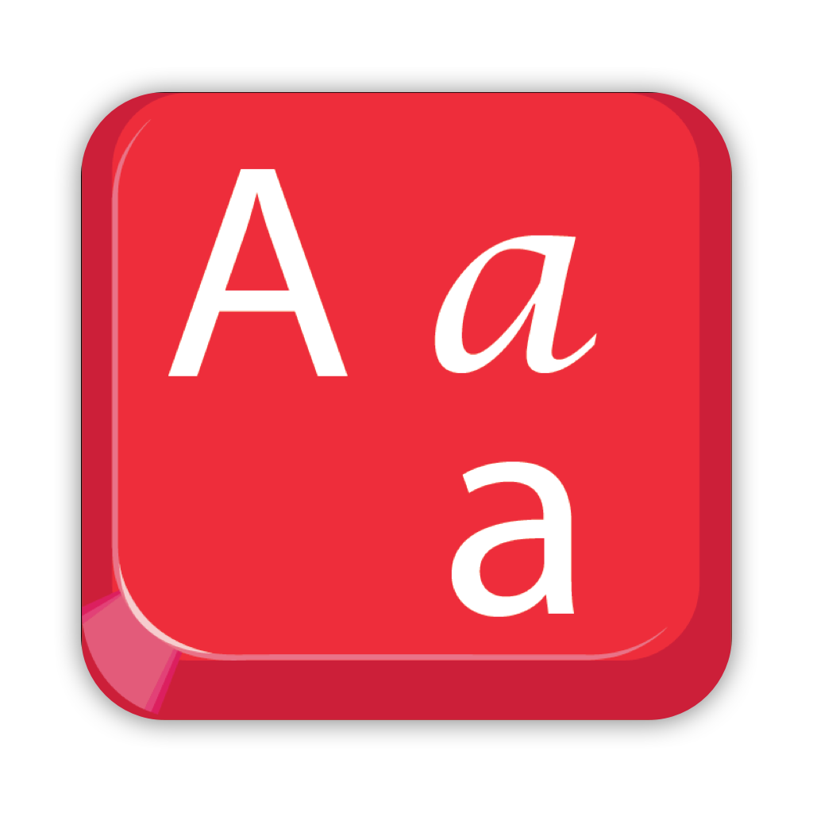
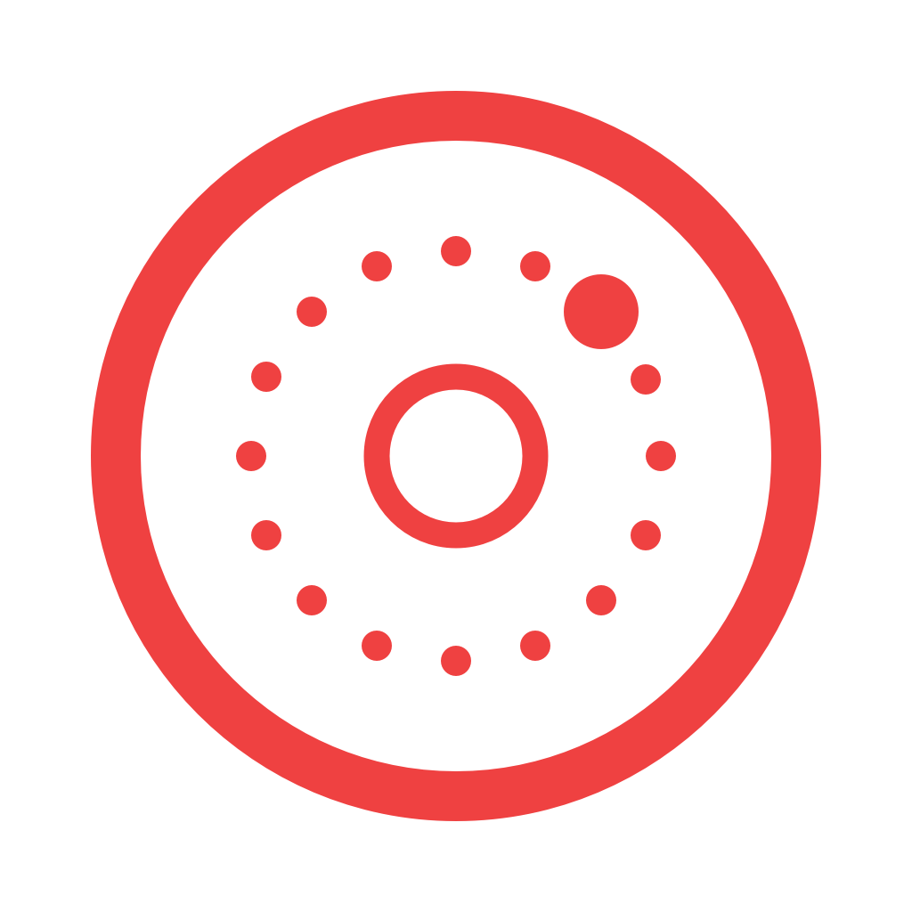
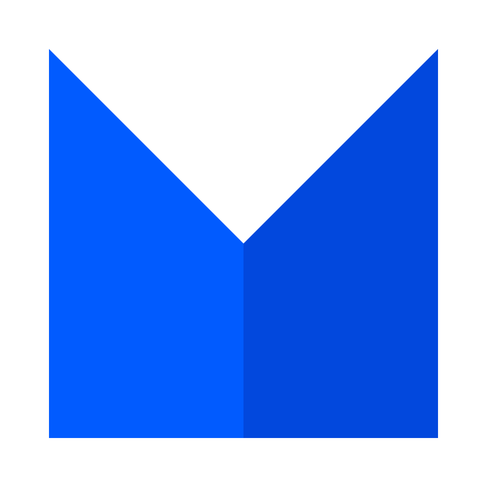

<p align="center">
    
</p>

<p align="center">
    
    
    
    
    
</p>


## About KeyboardKit

KeyboardKit is a Swift library that helps you build custom keyboards with Swift and SwiftUI. It extends the native keyboard APIs and provides you with a lot more functionality than is otherwise available.

The end result can look something like this...or entirely different:

<p align="center">
    
</p>

KeyboardKit lets you create keyboards that mimic the iOS stock keyboard in a single line of code. These keyboards can be customized to great extent to change their input keys, keyboard layout, design, behavior etc.

You can also use entirely custom views with the rich features of KeyboardKit, to create completely custom keyboard extensions. Most of the KeyboardKit features can be used on all major Apple platforms as well. 


## Supported Platforms

KeyboardKit supports `iOS 14`, `macOS 11`, `tvOS 14` and `watchOS 7`.

Although KeyboardKit builds on all platform, some features are unavailable on some platforms.


## Installation

KeyboardKit can be installed with the Swift Package Manager:

```
https://github.com/KeyboardKit/KeyboardKit.git
```

or with CocoaPods:

```
pod KeyboardKit
```

You can add the library to the main app, the keyboard extension and any other targets that need it.


## Getting started

The online documentation has a [getting-started guide][Getting-Started] that will help you get started with the library. 


## Documentation

The [online documentation][Documentation] has articles, code examples etc. that let you overview the various parts of the library and understand how they all connect to each other.

The online documentation is currently iOS-specific. To generate documentation for other platforms, open the package in Xcode, select a simulator then run `Product/Build Documentation`.


## Localization

KeyboardKit is localized in 60 keyboard-specific locales ([read more][Localization]):

🇦🇱 🇦🇪 🇦🇲 🇧🇾 🇧🇬 🇦🇩 🏳️ 🇭🇷 🇨🇿 🇩🇰 <br />

🇳🇱 🇧🇪 🇺🇸 🇬🇧 🇺🇸 🇪🇪 🇫🇴 🇵🇭 🇫🇮 🇫🇷 <br />

🇧🇪 🇨🇭 🇬🇪 🇩🇪 🇦🇹 🇨🇭 🇬🇷 🇺🇸 🇮🇱 🇭🇺 <br />

🇮🇸 🇮🇩 🇮🇪 🇮🇹 🇹🇯 🇹🇯 🇹🇯 🇱🇻 🇱🇹 🇲🇰 <br />

🇲🇾 🇲🇹 🇲🇳 🇳🇴 🇮🇷 🇵🇱 🇵🇹 🇧🇷 🇷🇴 🇷🇺 <br />

🇷🇸 🇷🇸 🇸🇰 🇸🇮 🇪🇸 🇰🇪 🇸🇪 🇹🇷 🇺🇦 🇺🇿 <br />


## Features

KeyboardKit comes packed features to help you build amazing and powerful keyboards:
 
* 💥 [Actions][Actions] - KeyboardKit comes with keyboard actions like characters, emojis, actions, custom ones etc.
* 🎨 [Appearance][Appearance] - KeyboardKit comes with an appearance engine that lets you easily style your keyboards.
* 💡 [Autocomplete][Autocomplete] - KeyboardKit can present autocomplete suggestions as the user types.
* 🗯 [Callouts][Callouts] - KeyboardKit can show input callouts, as well as long press callouts with secondary actions.
* 😊 [Emojis][Emojis] - KeyboardKit defines emojis and emoji categories that you can use in your own keyboards.
* ⌨️ [External Keyboards][External] - KeyboardKit lets you detect whether or not an external keyboard is used.
* 👋 [Feedback][Feedback] - KeyboardKit keyboards can give and haptic feedback feedback as the user types.
* 👆 [Gestures][Gestures] - KeyboardKit comes with keyboard-specific gestures that you can use in your own keyboards.
* 🔤 [Input][Input] - KeyboardKit supports creating `alphabetic`, `numeric` and `symbolic` and custom input sets. 
* 🔣 [Layout][Layout] - KeyboardKit supports creating keyboard layouts for various devices, locales etc.
* ⌨️ [Keyboard][Keyboard] - KeyboardKit supports different keyboard types, can inspect a keyboard's state etc.
* 🌐 [Locales][Localization]- KeyboardKit defines keyboard-specific locales with localized content and assets.
* 👁 [Previews][Previews] - KeyboardKit defines a bunch of tools that simplify previewing keyboard views in SwiftUI.
* ➡️ [Proxy][Proxy] - KeyboardKit defines a bunch of extensions to `UITextDocumentProxy`.
* 🚏 [Routing][Routing] - KeyboardKit lets you route text to other destinations than the main app.
* ⬅️ [RTL][RTL] - KeyboardKit supports RTL (right-to-left) locales, such as Arabic, Persian, Kurdish etc.
* ⚙️ [Settings][Settings] - KeyboardKit has tools for accessing and linking to an app's keyboard settings.


## KeyboardKit Pro

[KeyboardKit Pro][Pro] extends KeyboardKit with pro features, such as additional locales, autocomplete engines, more extensions, additional views etc. It lets you create fully localized system keyboards with a single line of code. 

KeyboardKit Pro requires a commercial license. Licenses can be purchased from the [website][Website] or from [Gumroad][Gumroad].


## Demo Applications

This project has a `Demo` folder with a demo apps that lets you try out different KeyboardKit features.

The demo app has 5 keyboard extensions:

* `English` has a `SystemKeyboard` with the standard, English locale.
* `Unicode` has a `SystemKeyboard` with unicode-based input keys.
* `Custom` has a `SystemKeyboard` with custom keys, layout and appearance.
* `Pro` uses KeyboardKit Pro and has a `SystemKeyboard` with all LRT locales.
* `ProRtl` uses KeyboardKit Pro and has a `SystemKeyboard` with all RTL locales.

Just open and run the demo app, then enable the keyboards you want to try under System Settings. Note that you need to enable full access to try some features, like audio and haptic feedback.


## Support

KeyboardKit is trusted and proudly sponsored by the following companies:

<a href="https://www.oribi.se/en">
    
</a>
<a href="https://www.phonetoroam.com">
    
</a>
<a href="https://vitalisapps.com">
    
</a>
<a href="https://letterkey.eu">
    
</a>
<a href="http://anomaly.net.au">
    
</a>
<a href="https://www.milocreative.com">
    
</a>

KeyboardKit is open-source and completely free, but you can sponsor this project on [GitHub Sponsors][Sponsors], upgrade to [KeyboardKit Pro][Pro] or get in touch for paid support.


## Contact

Feel free to reach out if you have questions or if you want to contribute in any way:

* Website: [keyboardkit.com][Website]
* Mastodon: [@keyboardkit@techhub.social][Mastodon]
* Twitter: [@getkeyboardkit][Twitter]
* E-mail: [info@getkeyboardkit.com][Email]


## License

KeyboardKit is available under the MIT license. See the [LICENSE][License] file for more info.


[Email]: mailto:info@getkeyboardkit.com
[Website]: https://keyboardkit.com
[Twitter]: http://twitter.com/getkeyboardkit
[Mastodon]: https://techhub.social/@keyboardkit
[Sponsors]: https://github.com/sponsors/danielsaidi

[Pro]: https://github.com/KeyboardKit/KeyboardKitPro
[Gumroad]: https://danielsaidi.gumroad.com

[Documentation]: https://keyboardkit.github.io/KeyboardKit/documentation/keyboardkit/
[Getting-Started]: https://keyboardkit.github.io/KeyboardKit/documentation/keyboardkit/getting-started

[Actions]: https://keyboardkit.github.io/KeyboardKit/documentation/keyboardkit/actions
[Appearance]: https://keyboardkit.github.io/KeyboardKit/documentation/keyboardkit/appearance
[Autocomplete]: https://keyboardkit.github.io/KeyboardKit/documentation/keyboardkit/autocomplete
[Callouts]: https://keyboardkit.github.io/KeyboardKit/documentation/keyboardkit/callouts
[Emojis]: https://keyboardkit.github.io/KeyboardKit/documentation/keyboardkit/emojis
[External]: https://keyboardkit.github.io/KeyboardKit/documentation/keyboardkit/external-keyboards
[Feedback]: https://keyboardkit.github.io/KeyboardKit/documentation/keyboardkit/feedback
[Gestures]: https://keyboardkit.github.io/KeyboardKit/documentation/keyboardkit/gestures
[Input]: https://keyboardkit.github.io/KeyboardKit/documentation/keyboardkit/input
[Keyboard]: https://keyboardkit.github.io/KeyboardKit/documentation/keyboardkit/keyboard
[Layout]: https://keyboardkit.github.io/KeyboardKit/documentation/keyboardkit/layout
[Localization]: https://keyboardkit.github.io/KeyboardKit/documentation/keyboardkit/localization
[Previews]: https://keyboardkit.github.io/KeyboardKit/documentation/keyboardkit/previews
[Proxy]: https://keyboardkit.github.io/KeyboardKit/documentation/keyboardkit/proxy-extensions
[Routing]: https://keyboardkit.github.io/KeyboardKit/documentation/keyboardkit/routing
[RTL]: https://keyboardkit.github.io/KeyboardKit/documentation/keyboardkit/rtl
[Settings]: https://keyboardkit.github.io/KeyboardKit/documentation/keyboardkit/settings


[License]: https://github.com/KeyboardKit/KeyboardKit/blob/master/LICENSE
