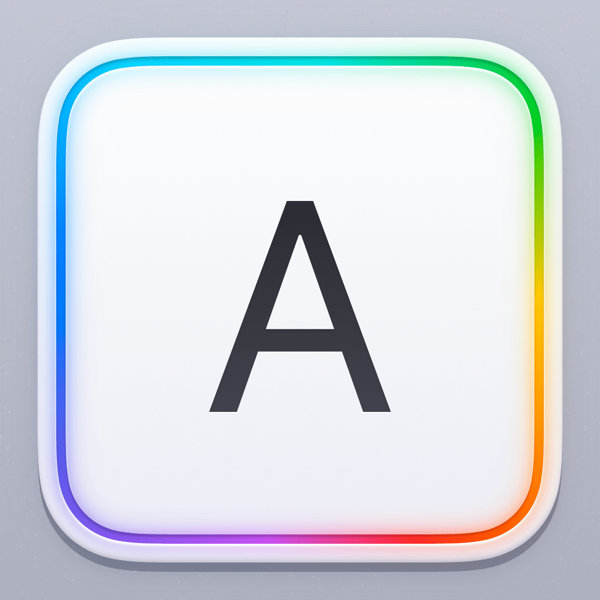

<p align="center">
    
</p>

<p align="center">
    
    
    
    <a href="https://keyboardkit.github.io/KeyboardKit"></a>
    
</p>

# KeyboardKit

KeyboardKit lets you create amazing [custom keyboard extensions][About] with a few lines of code, using Swift & SwiftUI.

<p align="center">
    
</p>

KeyboardKit extends Apple's limited keyboard APIs with more capabilities. It can be extended with [KeyboardKit Pro][Pro], which unlocks localized keyboards, autocomplete, an emoji keyboard, AI support, themes, and much more.


## Installation

KeyboardKit can be installed with the Swift Package Manager:

```
https://github.com/KeyboardKit/KeyboardKit.git
```

Since KeyboardKit is a binary framework, it must only linked to the main app target. All other targets will be able to use it without linking.

<!-- 
> [!NOTE]
> Starting with KeyboardKit 10.3, each release will include a multiplatform build. The tag name for a multiplatform release is the version number followed by `-multiplatform`, e.g. `10.3.0-multiplatform`.
-->


## Getting Started

The easiest way to set up KeyboardKit is to first create a `KeyboardApp` value for your app:

```swift
import KeyboardKit

extension KeyboardApp {

    static var keyboardKitDemo: KeyboardApp {
        .init(
            name: "KeyboardKit",
            licenseKey: "your-key-here",                // Needed for KeyboardKit Pro!
            appGroupId: "group.com.keyboardkit.demo",   // Sets up App Group data sync
            locales: .keyboardKitSupported,             // Sets up the enabled locales
            autocomplete: .init(                        // Sets up custom autocomplete  
                nextWordPredictionRequest: .claude(...) // Sets up AI-based prediction
            ),
            deepLinks: .init(app: "kkdemo://", ...)     // Defines how to open the app
        )
    }
}
```  

Next, let your `KeyboardController` inherit ``KeyboardInputViewController`` instead of `UIInputViewController`:

```swift
class KeyboardController: KeyboardInputViewController {}
```

This unlocks additional functions and capabilities, and adds `services` and observable `state` to the controller. 

Next, override `viewDidLoad()` and call `setup(for:)` to set up the keyboard extension for your app:

```swift
class KeyboardViewController: KeyboardInputViewController {

    override func viewDidLoad() {
        super.viewDidLoad()
        
        // Set up the keyboard with the app we created above
        setup(for: .keyboardKitDemo) { result in
            // If `result` is `.success`, the setup did succeed.
            // This is where you can setup custom services, etc.
        }
    }
}
```

This will make keyboard settings sync data between the main app and its keyboard if the `KeyboardApp` defines an ``appGroupId``, set up KeyboardKit Pro if it defines a ``licenseKey``, set up dictation and deep links, etc.

To replace or customize the standard ``KeyboardView``, just override `viewWillSetupKeyboardView()` and let it call `setupKeyboardView(_:)` with the view that you want to use:

```swift
class KeyboardViewController: KeyboardInputViewController {

    override func viewWillSetupKeyboardView() {
        setupKeyboardView { [weak self] controller in // <-- Use weak or unknowned self!
            KeyboardView(
                state: controller.state,
                buttonContent: { $0.view },
                buttonView: { $0.view },
                collapsedView: { $0.view },
                emojiKeyboard: { $0.view },
                toolbar: { $0.view }
            )
        }
    }
}
```

To set up your main app with the same keyboard configuration, just wrap the content view in a `KeyboardAppView`:

```swift
@main
struct MyApp: App {

    var body: some Scene {
        WindowGroup {
        
            // Here we use the keyboard app we created above
            KeyboardAppView(for: .keyboardKitDemo) {
                ContentView()
            }
        }
    }
}
```

For more information, see the [getting started guide][Getting-Started] and [essentials][Essentials] articles.


## Localization

KeyboardKit supports [75 locales][Localization]:

🇺🇸 🇦🇱 🇦🇪 🇦🇲 🇦🇿 🇧🇾 🇧🇩 🇧🇬 🇦🇩 🏳️ <br />
🏳️ 🇭🇷 🇨🇿 🇩🇰 🇳🇱 🇧🇪 🇦🇺 🇨🇦 🇬🇧 🇺🇸 <br />
🇪🇪 🇫🇴 🇵🇭 🇫🇮 🇫🇷 🇨🇦 🇧🇪 🇨🇭 🇬🇪 🇩🇪 <br />
🇦🇹 🇨🇭 🇬🇷 🇺🇸 🇮🇱 🇭🇺 🇮🇸 🏳️ 🇮🇩 🇮🇪 <br />
🇮🇹 🇰🇿 🇹🇯 🇹🇯 🇹🇯 🇱🇻 🇱🇹 🇲🇰 🇲🇾 🇲🇹 <br />
🇲🇳 🏳️ 🇳🇴 🇳🇴 🇮🇷 🇵🇱 🇵🇹 🇧🇷 🇷🇴 🇷🇺 <br />
🇷🇸 🇷🇸 🇹🇯 🇸🇰 🇸🇮 🇪🇸 🇦🇷 🇲🇽 🇸🇪 🇰🇪 <br />
🇹🇷 🇺🇦 🇺🇿 🇻🇳 🏴󠁧󠁢󠁷󠁬󠁳󠁿 <br />

[KeyboardKit Pro][Pro] unlocks localized keyboards, layouts, callouts and behaviors for all supported locales.


## Features

KeyboardKit provides a free, open-source keyboard engine. [KeyboardKit Pro][Pro] unlocks more powerful pro features.

* 🌱 [Essentials][Essentials] - Essential utilities, models, services & views.
* ⌨️ [Essentials - KeyboardView][Essentials-KeyboardView] - Render a native-looking, fully customizable keyboard.
* 💥 [Actions][Actions] - Trigger & handle keyboard-related actions.
* 🤖 [AI][AI] - Features that are needed by AI-based keyboards.
* 📱 [App][App] - App-specific utilities, settings, screens, etc.
* 💡 [Autocomplete][Autocomplete] - Autocomplete and autocorrect as the user types.
* 🗯 [Callouts][Callouts] - Show input & secondary action callouts.
* 📋 [Clipboard][Clipboard] - Create custom clips and integrate with the system clipboard.
* 🎤 [Dictation][Dictation] - Trigger dictation from the keyboard.
* 😀 [Emojis][Emojis] - Emoji models, an emoji keyboard, etc.
* ⌨️ [External][External] - Detect if an external keyboard is connected.
* 🔉 [Feedback][Feedback] - Trigger audio & haptic feedback with ease.
* 𝒜 [Fonts][Fonts] - Type with other fonts than the standard system font.
* 👆 [Gestures][Gestures] - Handle a rich set of gestures on any key.
* 🏠 [Host][Host] - Identify and open the host application.
* 📝 [Input][Input] - Keyboard input fields, Vietnamese support, etc.
* 🔣 [Layout][Layout] - A dynamic, customizable keyboard layout engine.
* 🌐 [Localization][Localization] - Locale-specific utilities for all supported locales.
* 🗺️ [Navigation][Navigation] - Open urls and other apps from the keyboard.
* 👁 [Previews][Previews] - Keyboard & theme previews for in-app use.
* 📄 [Proxy][Proxy] - Extend the text document proxy with more capabilities.
* ⚙️ [Settings][Settings] - Provide keyboard settings & link to System Settings.
* 🩺 [Status][Status] - Detect if a keyboard is enabled, has full access, etc.
* 🎨 [Styling][Styling] - Style your keyboard to great extent.
* 🍭 [Themes][Themes] - A theme engine with many pre-defined themes.


## Documentation

The [online documentation][Documentation] has a [getting started guide][Getting-Started], [feature articles][Feature-Articles], code samples, [developer guides][Developer-Guides], etc.


## Demo App

The `Demo` folder has a demo app that shows how to set up a main app and its keyboard extension, show keyboard status, provide in-app settings, link to system settings, apply custom styles, etc.

> [!IMPORTANT]
> The demo isn't code signed and can therefore not use an App Group to sync settings between the app and its keyboards. As such, the `KeyboardPro` keyboard has keyboard settings in the keyboard as well.


## KeyboardKit App

The [KeyboardKit app][KeyboardKit-App] on the App Store lets you download and try KeyboardKit without having to write any code.


## Support This Project

KeyboardKit is free to use, but you can support us by becoming a [GitHub Sponsor][Sponsors], upgrading to [KeyboardKit Pro][Pro] or [get in touch][Email] for freelance work, paid support etc.


## Contact

Feel free to reach out if you have questions or if you want to contribute in any way:

* Website: [keyboardkit.com][Website]
* E-mail: [info@keyboardkit.com][Email]
* Bluesky: [@keyboardkit.bsky.social][Bluesky]
* Mastodon: [@keyboardkit@techhub.social][Mastodon]


## License

KeyboardKit is closed-source. See the [LICENSE][License] file for more info.


[Email]: mailto:info@keyboardkit.com
[Website]: https://keyboardkit.com
[Bluesky]: https://bsky.app/profile/keyboardkit.bsky.social
[Mastodon]: https://techhub.social/@keyboardkit
[Sponsors]: https://github.com/sponsors/danielsaidi

[About]: https://keyboardkit.com/about
[KeyboardKit-App]: https://keyboardkit.com/app

[Pro]: https://keyboardkit.com/pro
[Documentation]: https://docs.keyboardkit.com
[License]: https://github.com/KeyboardKit/KeyboardKit/blob/master/LICENSE

[Getting-Started]: https://docs.keyboardkit.com/documentation/keyboardkit/getting-started-article
[Essentials]: https://docs.keyboardkit.com/documentation/keyboardkit/essentials-article
[Essentials-KeyboardView]: https://docs.keyboardkit.com/documentation/keyboardkit/essentials-keyboardview
[Developer-Guides]: https://docs.keyboardkit.com/documentation/keyboardkit/developer-articles
[Feature-Articles]: https://docs.keyboardkit.com/documentation/keyboardkit/features-articles

[Actions]: https://docs.keyboardkit.com/documentation/keyboardkit/actions-article
[AI]: https://docs.keyboardkit.com/documentation/keyboardkit/ai-article
[App]: https://docs.keyboardkit.com/documentation/keyboardkit/app-article
[Autocomplete]: https://docs.keyboardkit.com/documentation/keyboardkit/autocomplete-article
[Buttons]: https://docs.keyboardkit.com/documentation/keyboardkit/buttons-article
[Callouts]: https://docs.keyboardkit.com/documentation/keyboardkit/callouts-article
[Clipboard]: https://docs.keyboardkit.com/documentation/keyboardkit/clipboard-article
[Dictation]: https://docs.keyboardkit.com/documentation/keyboardkit/dictation-article
[Emojis]: https://docs.keyboardkit.com/documentation/keyboardkit/emojis-article
[External]: https://docs.keyboardkit.com/documentation/keyboardkit/external-keyboards-article
[Feedback]: https://docs.keyboardkit.com/documentation/keyboardkit/feedback-article
[Fonts]: https://docs.keyboardkit.com/documentation/keyboardkit/fonts-article
[Gestures]: https://docs.keyboardkit.com/documentation/keyboardkit/gestures-article
[Host]: https://docs.keyboardkit.com/documentation/keyboardkit/host-article
[Input]: https://docs.keyboardkit.com/documentation/keyboardkit/input-article
[Layout]: https://docs.keyboardkit.com/documentation/keyboardkit/layout-article
[Localization]: https://docs.keyboardkit.com/documentation/keyboardkit/localization-article
[Navigation]: https://docs.keyboardkit.com/documentation/keyboardkit/navigation-article
[Previews]: https://docs.keyboardkit.com/documentation/keyboardkit/previews-article
[Proxy]: https://docs.keyboardkit.com/documentation/keyboardkit/proxy-article
[Settings]: https://docs.keyboardkit.com/documentation/keyboardkit/settings-article
[Status]: https://docs.keyboardkit.com/documentation/keyboardkit/status-article
[Styling]: https://docs.keyboardkit.com/documentation/keyboardkit/styling-article
[Themes]: https://docs.keyboardkit.com/documentation/keyboardkit/themes-article
