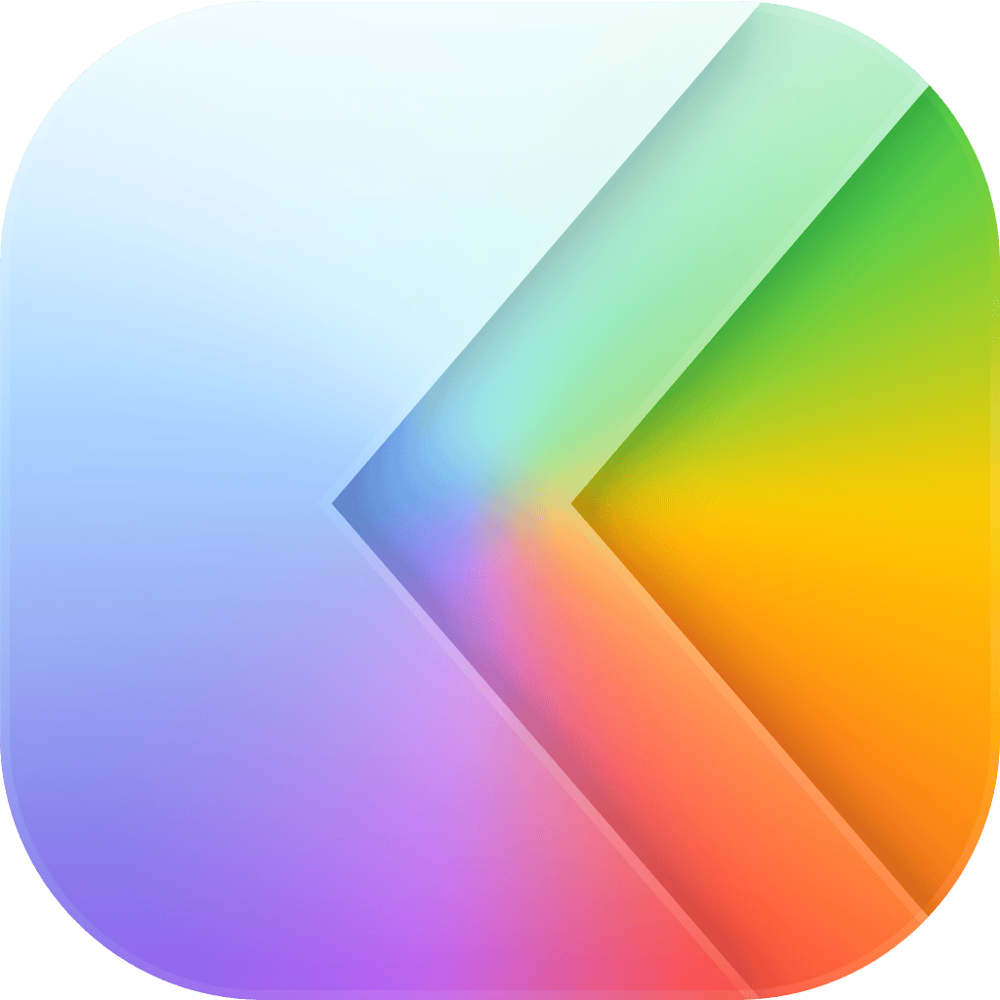
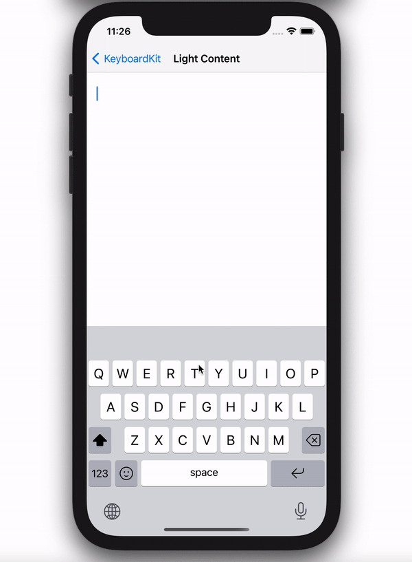

<p align="center">
    
</p>

<p align="center">
    
    
    
    <a href="https://keyboardkit.github.io/KeyboardKit"></a>
    
</p>


# KeyboardKit

KeyboardKit lets you create amazing [custom keyboard extensions][About] with a few lines of code, using Swift & SwiftUI.

<p align="center">
    
</p>

KeyboardKit extends Apple's limited keyboard APIs with more capabilities. It can be extended with [KeyboardKit Pro][Pro], which unlocks localized keyboards, autocomplete, an emoji keyboard, AI support, themes, and much more.


## Installation

KeyboardKit can be installed with the Swift Package Manager:

```
https://github.com/KeyboardKit/KeyboardKit.git
```

Since KeyboardKit is a binary framework, it must only linked to the main app target. All other targets will be able to use it without linking.


## Getting Started

The easiest way to set up KeyboardKit is to first create a `KeyboardApp` value for your app:

```swift
import KeyboardKit

extension KeyboardApp {

    static var keyboardKitDemo: KeyboardApp {
        .init(
            name: "KeyboardKit",
            licenseKey: "your-key-here",                // Needed for KeyboardKit Pro!
            appGroupId: "group.com.keyboardkit.demo",   // Sets up App Group data sync
            locales: .keyboardKitSupported,             // Sets up the enabled locales
            autocomplete: .init(                        // Sets up custom autocomplete  
                nextWordPredictionRequest: .claude(...) // Sets up AI-based prediction
            ),
            deepLinks: .init(app: "kkdemo://", ...)     // Defines how to open the app
        )
    }
}
```  

Next, let your `KeyboardController` inherit ``KeyboardInputViewController`` instead of `UIInputViewController`:

```swift
class KeyboardController: KeyboardInputViewController {}
```

This unlocks additional functions and capabilities, and adds `services` and observable `state` to the controller. 

Next, override `viewDidLoad()` and call `setup(for:)` to set up the keyboard extension for your app:

```swift
class KeyboardViewController: KeyboardInputViewController {

    override func viewDidLoad() {
        super.viewDidLoad()
        
        // Set up the keyboard with the app we created above
        setup(for: .keyboardKitDemo) { result in
            // If `result` is `.success`, the setup did succeed.
            // This is where you can setup custom services, etc.
        }
    }
}
```

This will make keyboard settings sync data between the main app and its keyboard if the `KeyboardApp` defines an ``appGroupId``, set up KeyboardKit Pro if it defines a ``licenseKey``, set up dictation and deep links, etc.

To replace or customize the standard ``KeyboardView``, just override `viewWillSetupKeyboardView()` and let it call `setupKeyboardView(_:)` with the view that you want to use:

```swift
class KeyboardViewController: KeyboardInputViewController {

    override func viewWillSetupKeyboardView() {
        setupKeyboardView { [weak self] controller in // <-- Use weak or unknowned self!
            KeyboardView(
                state: controller.state,
                buttonContent: { $0.view },
                buttonView: { $0.view },
                collapsedView: { $0.view },
                emojiKeyboard: { $0.view },
                toolbar: { $0.view }
            )
        }
    }
}
```

To set up your main app with the same keyboard configuration, just wrap the content view in a `KeyboardAppView`:

```swift
@main
struct MyApp: App {

    var body: some Scene {
        WindowGroup {
        
            // Here we use the keyboard app we created above
            KeyboardAppView(for: .keyboardKitDemo) {
                ContentView()
            }
        }
    }
}
```

For more information, see the [getting started guide][Getting-Started] and [essentials][Essentials] articles.


## Localization

KeyboardKit supports [75 locales][Localization]:

🇺🇸 🇦🇱 🇦🇪 🇦🇲 🇦🇿 🇧🇾 🇧🇩 🇧🇬 🇦🇩 🏳️ <br />
🏳️ 🇭🇷 🇨🇿 🇩🇰 🇳🇱 🇧🇪 🇦🇺 🇨🇦 🇬🇧 🇺🇸 <br />
🇪🇪 🇫🇴 🇵🇭 🇫🇮 🇫🇷 🇨🇦 🇧🇪 🇨🇭 🇬🇪 🇩🇪 <br />
🇦🇹 🇨🇭 🇬🇷 🇺🇸 🇮🇱 🇭🇺 🇮🇸 🏳️ 🇮🇩 🇮🇪 <br />
🇮🇹 🇰🇿 🇹🇯 🇹🇯 🇹🇯 🇱🇻 🇱🇹 🇲🇰 🇲🇾 🇲🇹 <br />
🇲🇳 🏳️ 🇳🇴 🇳🇴 🇮🇷 🇵🇱 🇵🇹 🇧🇷 🇷🇴 🇷🇺 <br />
🇷🇸 🇷🇸 🇹🇯 🇸🇰 🇸🇮 🇪🇸 🇦🇷 🇲🇽 🇸🇪 🇰🇪 <br />
🇹🇷 🇺🇦 🇺🇿 🇻🇳 🏴󠁧󠁢󠁷󠁬󠁳󠁿 <br />

[KeyboardKit Pro][Pro] unlocks localized keyboards, layouts, callouts and behaviors for all supported locales.


## Features

KeyboardKit provides a free, open-source keyboard engine. [KeyboardKit Pro][Pro] unlocks more powerful pro features.

* 🌱 [Essentials][Essentials] - Essential utilities, models, services & views.
* ⌨️ [Essentials - KeyboardView][Essentials-KeyboardView] - Render a native-looking, fully customizable keyboard.
* 💥 [Actions][Actions] - Trigger & handle keyboard-related actions.
* 🤖 [AI][AI] - Features that are needed by AI-based keyboards.
* 📱 [App][App] - App-specific utilities, settings, screens, etc.
* 💡 [Autocomplete][Autocomplete] - Autocomplete and autocorrect as the user types.
* 🗯 [Callouts][Callouts] - Show input & secondary action callouts.
* 📋 [Clipboard][Clipboard] - Create custom clips and integrate with the system clipboard.
* 🎤 [Dictation][Dictation] - Trigger dictation from the keyboard.
* 😀 [Emojis][Emojis] - Emoji models, an emoji keyboard, etc.
* ⌨️ [External][External] - Detect if an external keyboard is connected.
* 🔉 [Feedback][Feedback] - Trigger audio & haptic feedback with ease.
* 𝒜 [Fonts][Fonts] - Type with other fonts than the standard system font.
* 🏠 [Host][Host] - Identify and open the host application.
* 📝 [Input][Input] - Keyboard input fields, Vietnamese support, etc.
* 🔣 [Layout][Layout] - A dynamic, customizable keyboard layout engine.
* 🌐 [Localization][Localization] - Locale-specific utilities for all supported locales.
* 🗺️ [Navigation][Navigation] - Open urls and other apps from the keyboard.
* 👁 [Previews][Previews] - Keyboard & theme previews for in-app use.
* 📄 [Proxy][Proxy] - Extend the text document proxy with more capabilities.
* ⚙️ [Settings][Settings] - Sync keyboard settings across targets, and link to System Settings.
* 🩺 [Status][Status] - Detect if a keyboard is enabled, has full access, etc.
* 🎨 [Styling][Styling] - Style your keyboard to great extent.
* 🍭 [Themes][Themes] - A theme engine with many pre-defined themes.


## Documentation

The [online documentation][Documentation] has a [getting started guide][Getting-Started], [feature articles][Feature-Articles], code samples, [developer guides][Developer-Guides], etc.


## Demo App

The `Demo` folder has a demo app that shows how to set up a main app and its keyboard extension, show keyboard status, provide in-app settings, link to system settings, apply custom styles, etc.

> [!IMPORTANT]
> The demo isn't code signed and can therefore not use an App Group to sync settings between the app and its keyboards. As such, the `KeyboardPro` keyboard has keyboard settings in the keyboard as well.


## KeyboardKit App

The [KeyboardKit app][KeyboardKit-App] on the App Store lets you download and try KeyboardKit without having to write any code.


## Support This Project

KeyboardKit is free to use, but you can support us by becoming a [GitHub Sponsor][Sponsors], upgrading to [KeyboardKit Pro][Pro] or [get in touch][Email] for freelance work, paid support etc.


## Contact

Feel free to reach out if you have questions or if you want to contribute in any way:

* Website: [keyboardkit.com][Website]
* E-mail: [info@keyboardkit.com][Email]
* Bluesky: [@keyboardkit.bsky.social][Bluesky]
* Mastodon: [@keyboardkit@techhub.social][Mastodon]


## License

KeyboardKit is closed-source. See the [LICENSE][License] file for more info.


[Email]: mailto:info@keyboardkit.com
[Website]: https://keyboardkit.com
[Bluesky]: https://bsky.app/profile/keyboardkit.bsky.social
[Mastodon]: https://techhub.social/@keyboardkit
[Sponsors]: https://github.com/sponsors/danielsaidi

[About]: https://keyboardkit.com/about
[KeyboardKit-App]: https://keyboardkit.com/app

[Pro]: https://keyboardkit.com/pro
[Documentation]: https://docs.keyboardkit.com
[License]: https://github.com/KeyboardKit/KeyboardKit/blob/master/LICENSE

[Getting-Started]: https://docs.keyboardkit.com/documentation/keyboardkit/getting-started-article
[Essentials]: https://docs.keyboardkit.com/documentation/keyboardkit/essentials-article
[Essentials-KeyboardView]: https://docs.keyboardkit.com/documentation/keyboardkit/essentials-keyboardview
[Developer-Guides]: https://docs.keyboardkit.com/documentation/keyboardkit/developer-articles
[Feature-Articles]: https://docs.keyboardkit.com/documentation/keyboardkit/features-articles

[Actions]: https://docs.keyboardkit.com/documentation/keyboardkit/actions-article
[AI]: https://docs.keyboardkit.com/documentation/keyboardkit/ai-article
[App]: https://docs.keyboardkit.com/documentation/keyboardkit/app-article
[Autocomplete]: https://docs.keyboardkit.com/documentation/keyboardkit/autocomplete-article
[Buttons]: https://docs.keyboardkit.com/documentation/keyboardkit/buttons-article
[Callouts]: https://docs.keyboardkit.com/documentation/keyboardkit/callouts-article
[Clipboard]: https://docs.keyboardkit.com/documentation/keyboardkit/clipboard-article
[Dictation]: https://docs.keyboardkit.com/documentation/keyboardkit/dictation-article
[Emojis]: https://docs.keyboardkit.com/documentation/keyboardkit/emojis-article
[External]: https://docs.keyboardkit.com/documentation/keyboardkit/external-keyboards-article
[Feedback]: https://docs.keyboardkit.com/documentation/keyboardkit/feedback-article
[Fonts]: https://docs.keyboardkit.com/documentation/keyboardkit/fonts-article
[Host]: https://docs.keyboardkit.com/documentation/keyboardkit/host-article
[Input]: https://docs.keyboardkit.com/documentation/keyboardkit/input-article
[Layout]: https://docs.keyboardkit.com/documentation/keyboardkit/layout-article
[Localization]: https://docs.keyboardkit.com/documentation/keyboardkit/localization-article
[Navigation]: https://docs.keyboardkit.com/documentation/keyboardkit/navigation-article
[Previews]: https://docs.keyboardkit.com/documentation/keyboardkit/previews-article
[Proxy]: https://docs.keyboardkit.com/documentation/keyboardkit/proxy-article
[Settings]: https://docs.keyboardkit.com/documentation/keyboardkit/settings-article
[Status]: https://docs.keyboardkit.com/documentation/keyboardkit/status-article
[Styling]: https://docs.keyboardkit.com/documentation/keyboardkit/styling-article
[Themes]: https://docs.keyboardkit.com/documentation/keyboardkit/themes-article


## 🌐 Web Resources & Aesthetic Symbols Index
- [SYM 2688](https://clean-unicode-text-35.pages.dev/symbol/sym-2688/)
- [TWELVE POINTED STAR](https://zen-space-symbols-89.pages.dev/symbol/twelve-pointed-star/)
- [CYBER PHANTOM GLYPH](https://anime-sparkle-text-81.pages.dev/symbol/cyber-phantom-glyph/)
- [SYM 2670](https://zen-arrow-symbols-99.pages.dev/symbol/sym-2670/)
- [SYM 1D41A](https://theeduplaycampen.pages.dev/symbol/sym-1d41a/)
- [SYM 26FA](https://neon-matrix-fonts-47.pages.dev/symbol/sym-26fa/)
- [SYM 273E](https://clean-mono-fonts-64.pages.dev/symbol/sym-273e/)
- [SYM 265B](https://kawaii-kaomoji-hub-89.pages.dev/symbol/sym-265b/)
- [SYM 1D405](https://classic-poetry-fonts-16.pages.dev/symbol/sym-1d405/)
- [RINGED PLANET SATURN](https://mecha-text-vault-91.pages.dev/symbol/ringed-planet-saturn/)
- [SYM 1F47B](https://pearl-heart-symbols-95.pages.dev/symbol/sym-1f47b/)
- [SYM 1D41B](https://minimal-star-symbols-63.pages.dev/symbol/sym-1d41b/)
- [SYM 1F978](https://anime-sparkle-text-58.pages.dev/symbol/sym-1f978/)
- [SYM 1D421](https://sleek-arrow-symbols-42.pages.dev/symbol/sym-1d421/)
- [SYM 1D414](https://clean-mono-fonts-64.pages.dev/symbol/sym-1d414/)
- [FOUR POINT STAR SPARKLE](https://kawaii-kaomoji-hub-89.pages.dev/symbol/four-point-star-sparkle/)
- [SYM 1F928](https://tech-glitch-symbols-36.pages.dev/symbol/sym-1f928/)
- [ROYAL GOLD CROWN](https://kawaii-kaomoji-hub-89.pages.dev/symbol/royal-gold-crown/)
- [CUTE BUNNY RABBIT FACE](https://coquette-aesthetic-symbols-62.pages.dev/symbol/cute-bunny-rabbit-face/)
- [SYM 2764 FE0F](https://coquette-aesthetic-symbols-29.pages.dev/symbol/sym-2764-fe0f/)
- [ROBLOX NAMES](https://cyber-clan-tags-36.pages.dev/ja/roblox-names/)
- [TABLE FLIP RAGE KAOMOJI](https://clean-space-text-47.pages.dev/symbol/table-flip-rage-kaomoji/)
- [SYM 1D44D](https://vintage-runes-text-35.pages.dev/symbol/sym-1d44d/)
- [SYM 26CB](https://vintage-coquette-text-58.pages.dev/symbol/sym-26cb/)
- [SYM 2674](https://vintage-runes-text-35.pages.dev/symbol/sym-2674/)
- [SYM 1F63E](https://clean-mono-fonts-64.pages.dev/symbol/sym-1f63e/)
- [CLOCKWISE OPEN CIRCLE ARROW](https://theeduplaycampen.pages.dev/symbol/clockwise-open-circle-arrow/)
- [SYM 2659](https://glitch-font-studio-46.pages.dev/symbol/sym-2659/)
- [ZODIAC CELESTIAL](https://classic-typewriter-symbols-19.pages.dev/ja/zodiac-celestial/)
- [SYM 1D40A](https://classic-poetry-fonts-16.pages.dev/symbol/sym-1d40a/)
- [SYM 2688](https://neon-futuristic-symbols-58.pages.dev/symbol/sym-2688/)
- [SPRING TULIP BLOSSOM](https://dark-poetry-fonts-30.pages.dev/symbol/spring-tulip-blossom/)
- [SYM 1D498](https://vintage-runes-text-35.pages.dev/symbol/sym-1d498/)
- [SYM 2633](https://tech-glitch-symbols-36.pages.dev/symbol/sym-2633/)
- [AESTHETIC STARDUST COMBO](https://zen-aesthetic-fonts-87.pages.dev/symbol/aesthetic-stardust-combo/)
- [TIKTOK CAPTIONS](https://clean-mono-fonts-64.pages.dev/ru/tiktok-captions/)
- [GAMING WEAPONS](https://neon-futuristic-symbols-58.pages.dev/es/gaming-weapons/)
- [TRENDING](https://pastel-chibi-fonts-48.pages.dev/trending/)
- [SYM 1D463](https://matrix-hacker-fonts-85.pages.dev/symbol/sym-1d463/)
- [SYM 1D44A](https://kawaii-kaomoji-hub-99.pages.dev/symbol/sym-1d44a/)
- [SYM 1D42A](https://mystic-occult-unicode-49.pages.dev/symbol/sym-1d42a/)
- [SYM 1D413](https://baroque-font-vault-96.pages.dev/symbol/sym-1d413/)
- [SYM 2654](https://vintage-lace-fonts-79.pages.dev/symbol/sym-2654/)
- [SINGLE EIGHTH MUSICAL NOTE](https://minimal-star-symbols-87.pages.dev/symbol/single-eighth-musical-note/)
- [SYM 1F49E](https://clean-mono-fonts-64.pages.dev/symbol/sym-1f49e/)
- [SYM 1D437](https://clean-mono-fonts-64.pages.dev/symbol/sym-1d437/)
- [SYM 1D45F](https://vintage-coquette-text-58.pages.dev/symbol/sym-1d45f/)
- [SYM 1F927](https://scholarly-script-hub-43.pages.dev/symbol/sym-1f927/)
- [SYM 1D496](https://clean-space-text-47.pages.dev/symbol/sym-1d496/)
- [GREEK PSI TRIDENT](https://glitch-mecha-kaomoji-69.pages.dev/symbol/greek-psi-trident/)
- [FREEFIRE NAMES](https://soft-angel-symbols-33.pages.dev/es/freefire-names/)
- [SYM 273D](https://theeduplaycampen.pages.dev/symbol/sym-273d/)
- [SYM 1F92F](https://angelic-soft-text-59.pages.dev/symbol/sym-1f92f/)
- [SYM 1D461](https://cyber-clan-tags-90.pages.dev/symbol/sym-1d461/)
- [SYM 1D44B](https://kawaii-kaomoji-hub-99.pages.dev/symbol/sym-1d44b/)
- [SYM 1FAE8](https://gothic-bio-fonts-61.pages.dev/symbol/sym-1fae8/)
- [SYM 26C2](https://subtle-arrow-fonts-98.pages.dev/symbol/sym-26c2/)
- [BRACKETS](https://vintage-runes-text-35.pages.dev/ja/brackets/)
- [HEARTS](https://mystic-occult-unicode-49.pages.dev/pt/hearts/)
- [SYM 1F634](https://angelic-soft-text-59.pages.dev/symbol/sym-1f634/)
- [ZODIAC CELESTIAL](https://tech-glitch-symbols-36.pages.dev/ru/zodiac-celestial/)
- [SIXTEEN POINTED STAR](https://kawaii-kaomoji-hub-89.pages.dev/symbol/sixteen-pointed-star/)
- [SYM 26C6](https://neon-matrix-symbols-94.pages.dev/symbol/sym-26c6/)
- [SYM 2738](https://archival-rune-symbols-42.pages.dev/symbol/sym-2738/)
- [MODERN BULLET SYMBOLS 45.PAGES.DEV](https://modern-bullet-symbols-45.pages.dev/)
- [SAGITTARIUS ZODIAC ARCHER](https://vintage-runes-text-35.pages.dev/symbol/sagittarius-zodiac-archer/)
- [SYM 274A](https://ethereal-goth-symbols-29.pages.dev/symbol/sym-274a/)
- [SYM 1D459](https://neon-matrix-symbols-94.pages.dev/symbol/sym-1d459/)
- [SYM 1F92F](https://sleek-bio-symbols-40.pages.dev/symbol/sym-1f92f/)
- [SYM 1D480](https://classic-poetry-fonts-16.pages.dev/symbol/sym-1d480/)
- [BLACK CENTRE STAR](https://cyber-clan-tags-90.pages.dev/symbol/black-centre-star/)
- [SYM 1F641](https://kawaii-kaomoji-hub-99.pages.dev/symbol/sym-1f641/)
- [MUSIC WEATHER](https://kawaii-kaomoji-hub-89.pages.dev/ru/music-weather/)
- [SYM 1D48B](https://vintage-bow-fonts-72.pages.dev/symbol/sym-1d48b/)
- [SYM 1D419](https://neon-matrix-fonts-47.pages.dev/symbol/sym-1d419/)
- [SYM 1D474](https://occult-aesthetic-symbols-26.pages.dev/symbol/sym-1d474/)
- [SYM 2640](https://coquette-aesthetic-symbols-62.pages.dev/symbol/sym-2640/)
- [SYM 1D434](https://occult-aesthetic-symbols-26.pages.dev/symbol/sym-1d434/)
- [SYM 1F62E 200D 1F4A8](https://soft-angel-symbols-33.pages.dev/symbol/sym-1f62e-200d-1f4a8/)
- [TRENDING](https://minimal-star-symbols-63.pages.dev/ja/trending/)
- [DAGGER BLADE](https://kawaii-kaomoji-hub-89.pages.dev/symbol/dagger-blade/)
- [HIGH VOLTAGE LIGHTNING](https://kawaii-kaomoji-hub-89.pages.dev/symbol/high-voltage-lightning/)
- [SYM 2642](https://neon-matrix-symbols-94.pages.dev/symbol/sym-2642/)
- [HEAVY HEART EXCLAMATION](https://kawaii-kaomoji-hub-89.pages.dev/symbol/heavy-heart-exclamation/)
- [STARRY ELEVATION AURA](https://minimal-star-symbols-63.pages.dev/symbol/starry-elevation-aura/)
- [LIBRA ZODIAC SCALES](https://neon-matrix-fonts-47.pages.dev/symbol/libra-zodiac-scales/)
- [SYM 1D463](https://vintage-bow-fonts-72.pages.dev/symbol/sym-1d463/)
- [SYM 26FA](https://pink-ribbon-fonts-28.pages.dev/symbol/sym-26fa/)
- [SYM 1F630](https://cyber-clan-tags-90.pages.dev/symbol/sym-1f630/)
- [SYM 1F61B](https://vintage-lace-fonts-79.pages.dev/symbol/sym-1f61b/)
- [SYM 26ED](https://pink-ribbon-fonts-28.pages.dev/symbol/sym-26ed/)
- [SYM 1F617](https://vintage-scholarly-text-77.pages.dev/symbol/sym-1f617/)
- [LEFT WING CLAN FLARE](https://vintage-runes-text-35.pages.dev/symbol/left-wing-clan-flare/)
- [MUSIC WEATHER](https://mystic-occult-unicode-49.pages.dev/pt/music-weather/)
- [STARS](https://cyber-clan-tags-90.pages.dev/ja/stars/)
- [SYM 26AF](https://occult-aesthetic-symbols-26.pages.dev/symbol/sym-26af/)
- [SYM 2748](https://modern-bullet-symbols-45.pages.dev/symbol/sym-2748/)
- [SYM 1D470](https://classic-poetry-fonts-16.pages.dev/symbol/sym-1d470/)
- [SYM 1F649](https://dark-poetry-fonts-30.pages.dev/symbol/sym-1f649/)
- [SYM 26F8](https://pink-ribbon-fonts-28.pages.dev/symbol/sym-26f8/)
- [SYM 26E9](https://soft-angel-symbols-33.pages.dev/symbol/sym-26e9/)
- [SYM 1F917](https://cyber-clan-tags-36.pages.dev/symbol/sym-1f917/)
- [SYM 1F611](https://neon-futuristic-symbols-58.pages.dev/symbol/sym-1f611/)
- [SYM 2666](https://coquette-aesthetic-symbols-62.pages.dev/symbol/sym-2666/)
- [SYM 1D42B](https://pure-dot-symbols-31.pages.dev/symbol/sym-1d42b/)
- [SYM 2724](https://angelic-soft-text-59.pages.dev/symbol/sym-2724/)
- [SYM 26B0](https://cyber-clan-tags-20.pages.dev/symbol/sym-26b0/)
- [SYM 1F497](https://dark-poetry-fonts-30.pages.dev/symbol/sym-1f497/)
- [TIKTOK CAPTIONS](https://mystic-occult-unicode-49.pages.dev/vi/tiktok-captions/)
- [SYM 267E](https://subtle-arrow-fonts-98.pages.dev/symbol/sym-267e/)
- [SYM 1D4A2](https://archival-rune-symbols-42.pages.dev/symbol/sym-1d4a2/)
- [GEORGIAN LOVE HEART](https://kawaii-kaomoji-hub-89.pages.dev/symbol/georgian-love-heart/)
- [KAOMOJI](https://tech-glitch-symbols-36.pages.dev/vi/kaomoji/)
- [DAGGER BLADE](https://anime-sparkle-text-45.pages.dev/symbol/dagger-blade/)
- [GAMING WEAPONS](https://mystic-occult-unicode-49.pages.dev/pt/gaming-weapons/)
- [SYM 1D461](https://anime-sparkle-text-45.pages.dev/symbol/sym-1d461/)
- [TABLE FLIP RAGE KAOMOJI](https://kawaii-kaomoji-hub-99.pages.dev/symbol/table-flip-rage-kaomoji/)
- [SYM 2733](https://coquette-aesthetic-symbols-62.pages.dev/symbol/sym-2733/)
- [TRENDING](https://mystic-occult-unicode-49.pages.dev/ja/trending/)
- [CHEERING FIGHTING FIST KAOMOJI](https://coquette-aesthetic-symbols-63.pages.dev/symbol/cheering-fighting-fist-kaomoji/)
- [SYM 26D3](https://angelic-soft-text-59.pages.dev/symbol/sym-26d3/)
- [SYM 1F609](https://coquette-aesthetic-symbols-76.pages.dev/symbol/sym-1f609/)
- [SYM 1D489](https://theeduplaycampen.pages.dev/symbol/sym-1d489/)
- [SYM 1F976](https://classic-poetry-fonts-16.pages.dev/symbol/sym-1f976/)
- [KAOMOJI](https://coquette-heart-text-40.pages.dev/vi/kaomoji/)
- [FLOWER GIRL SMILE KAOMOJI](https://vintage-coquette-text-58.pages.dev/symbol/flower-girl-smile-kaomoji/)
- [SYM 26F2](https://coquette-aesthetic-symbols-62.pages.dev/symbol/sym-26f2/)
- [SYM 1F601](https://kawaii-kaomoji-hub-99.pages.dev/symbol/sym-1f601/)
- [SYM 1F973](https://clean-aesthetic-fonts-33.pages.dev/symbol/sym-1f973/)
- [SYM 1F49E](https://pink-ribbon-fonts-28.pages.dev/symbol/sym-1f49e/)
