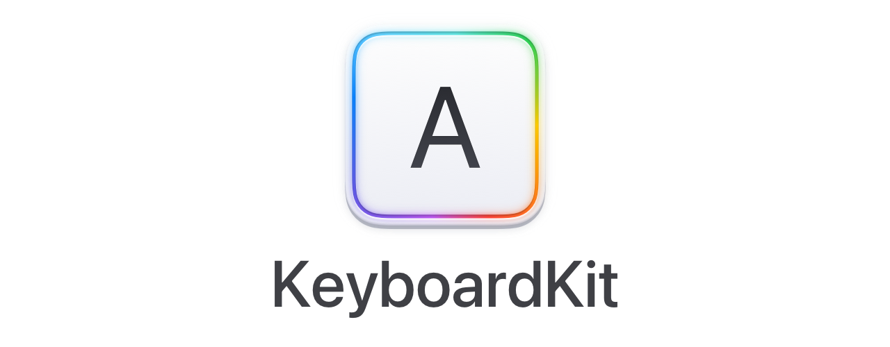

# KeyboardKit

<p align="center">
    
</p>

<p align="center">
    
    
    
    
    <a href="https://twitter.com/danielsaidi">
        
    </a>
</p>


## About KeyboardKit

KeyboardKit is a Swift library that helps you create custom keyboard extensions for `iOS` and `ipadOS`.

KeyboardKit provides you with `actions`, `input sets` and `layouts`, `appearances` and `autocomplete` support, `haptic` and `audio` feedback etc. It lets you create keyboards with `characters`, `numbers`, `symbols`, `emojis`, `images` and more or just use the additional `tools` and `extensions` that it provides. 

The end result can look something like this...or entirely different:

<p align="center">
    
</p>

If you're new to iOS keyboard extensions, [this great guide][Guide] will help you get started. You can also have a look at the demo app for inspiration.


## SwiftUI vs. UIKit

KeyboardKit supports both `SwiftUI` and `UIKit`, but SwiftUI is the main focus going forward. You can read more about UIKit support [here][UIKit]. The rest of this readme assumes that you're using SwiftUI, although most information is valid for both UIKit and SwiftUI.


## Installation

### Swift Package Manager

```
https://github.com/danielsaidi/KeyboardKit.git
```

### CocoaPods

```ruby
target 'MyApp' do
  pod 'KeyboardKit'
end

target 'MyKeyboard' do
  pod 'KeyboardKit'
end

post_install do |installer|
   installer.pods_project.targets.each do |target|
      target.build_configurations.each do |config|
          config.build_settings['APPLICATION_EXTENSION_API_ONLY'] = 'No'
      end
   end
end
```


## Getting Started

To build a keyboard extension with KeyboardKit, start by adding `KeyboardKit` to your project, as shown above. 

You should then inherit `KeyboardInputViewController` instead of `UIInputViewController`. It provides you with many convenient services, tools and extensions that extend the native keyboard framework.

For instance, `keyboardContext` provides you with contextual information, `keyboardActionHandler` can be used to handle keyboard-specific actions and `keyboardLayoutProvider` can provide you with keyboard layouts. There are much more here, as well as extensions that extend types like `UITextDocumentProxy` with more functionality. 

`KeyboardInputViewController` also has a `setup(with:)` function that can be used to setup the extension with any `SwiftUI` view. This will make it the main view for the extension, inject the necessary environment objects and finally resize the keyboard extension to fit the view. 

To learn more about and see KeyboardKit in practice, continue reading about the various parts of the library below and have a look at the demo app.


## Features


### 💥 Keyboard Actions

KeyboardKit comes with many keyboard-specific actions, like `character` inputs, `emojis`, `backspace`, `space`, `newline`, `image` etc. You can even create your own actions.

[Read more here][Keyboard-Actions]


### 😊 Keyboard Types

KeyboardKit comes with many different keyboard types, like `alphabetic`, `numeric`, `symbolic`, `emoji` etc. You can even create your own types.

[Read more here][Keyboard-Types]


### 🔤 Input Sets

KeyboardKit comes with an input set engine that make it easy to create `alphabetic`, `numeric` and `symbolic`  keyboards in different languages.

[Read more here][Input-Sets]


### ⌨️ Keyboard Layouts

KeyboardKit comes with a layout engine that makes it easy to create specific keyboard layouts for various devices, orientations and locales.

[Read more here][Keyboard-Layouts]


### 🎨 Appearances

KeyboardKit lets you create everything from completely custom keyboards to keyboards that imitate the native keyboards and can be styled with custom appearances.

[Read more here][Appearance]


### 🗯 Callouts

KeyboardKit lets you show callout bubbles as the users type, as well as secondary action callouts that can provide users with optional actions when long pressing a keyboard button.

[Read more here][Callouts]


### 💡Autocomplete

KeyboardKit can present autocomplete suggestions to users as they type. The core library doesn't come with an implemented engine, but you can inject your own. 

[Read more here][Autocomplete]


### ✋ Haptic Feedback

KeyboardKit keyboards can give users haptic feedback as they type. 

[Read more here][Haptic-Feedback].


### 🔈 Audio Feedback

KeyboardKit keyboards can give users audio feedback as they type. 

[Read more here][Audio-Feedback].


### 📦 Extensions

KeyboardKit comes with many keyboard-specific extensions, like providing the text document proxy with powerful, otherwise missing functionalty etc. Check out the demo apps and source code for examples and more information.


## Demo Application

This repository contains a demo app that demonstrates different keyboards, like `alphabetical` (lowercased, uppercased and capslocked), `numerical`, `symbols`, `emojis` and `images`.

The demo app is not intended to be production ready or provide pixel perfection, but rather to give you inspiration to how you can build your own keyboards.

To run the demo app, open and run the `Demo/Demo.xcodeproj` project, then enable the keyboards under system settings. Enable full access to support all features, like audio and haptic feedback.


## Contact me

Feel free to reach out if you have questions or if you want to contribute in any way:

* E-mail: [daniel.saidi@gmail.com][Email]
* Twitter: [@danielsaidi][Twitter]
* Web site: [danielsaidi.com][Website]


## Sponsors and Clients

This project is proudly sponsored by the following individuals and companies:

* [@booch](https://github.com/booch)

<a href="https://www.oribi.se/en">
    
</a>
<a href="http://anomaly.net.au">
    
</a>
<a href="https://www.milocreative.com">
    
</a>

You can support my work by sponsoring the project on [GitHub Sponsors][Sponsors] or hiring me for consultation. I'd be happy to help you out in any way that I can.


## License

KeyboardKit is available under the MIT license. See LICENSE file for more info.


[Email]: mailto:daniel.saidi@gmail.com
[Twitter]: http://www.twitter.com/danielsaidi
[Website]: http://www.danielsaidi.com
[Sponsors]: https://github.com/sponsors/danielsaidi

[Appearance]: https://github.com/danielsaidi/KeyboardKit/blob/master/Readmes/Appearance.md
[Audio-Feedback]: https://github.com/danielsaidi/KeyboardKit/blob/master/Readmes/Audio-Feedback.md
[Autocomplete]: https://github.com/danielsaidi/KeyboardKit/blob/master/Readmes/Autocomplete.md
[Haptic-Feedback]: https://github.com/danielsaidi/KeyboardKit/blob/master/Readmes/Haptic-Feedback.md
[Callouts]: https://github.com/danielsaidi/KeyboardKit/blob/master/Readmes/Callouts.md
[Emojis]: https://github.com/danielsaidi/KeyboardKit/blob/master/Readmes/Emojis.md
[Gestures]: https://github.com/danielsaidi/KeyboardKit/blob/master/Readmes/Gestures.md
[Input-Sets]: https://github.com/danielsaidi/KeyboardKit/blob/master/Readmes/Input-Sets.md
[Keyboard-Actions]: https://github.com/danielsaidi/KeyboardKit/blob/master/Readmes/Keyboard-Actions.md
[Keyboard-Layouts]: https://github.com/danielsaidi/KeyboardKit/blob/master/Readmes/Keyboard-Layouts.md
[Keyboard-Types]: https://github.com/danielsaidi/KeyboardKit/blob/master/Readmes/Keyboard-Types.md
[Localization]: https://github.com/danielsaidi/KeyboardKit/blob/master/Readmes/Localization.md
[Resources]: https://github.com/danielsaidi/KeyboardKit/blob/master/Readmes/Resources.md
[SwiftUI]: https://github.com/danielsaidi/KeyboardKit/blob/master/Readmes/SwiftUI.md
[Tutorial]: https://github.com/danielsaidi/KeyboardKit/blob/master/Readmes/SwiftUI-Tutorial.md

[UIKit]: https://github.com/danielsaidi/KeyboardKit/blob/master/UIKit/README.md
[UIKit-Tutorial]: https://github.com/danielsaidi/KeyboardKit/blob/master/UIKit/Tutorial.md

[Guide]: https://shyngys.com/ios-custom-keyboard-guide

[Anomaly]: http://anomaly.net.au
[Milo]: https://www.milocreative.com
